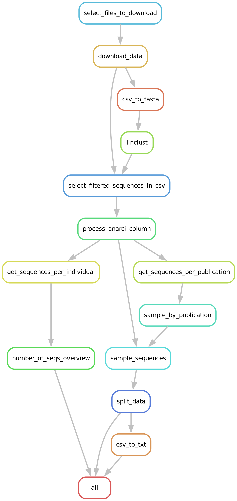

# Antibody PLM Training Pipeline

A fully reproducible **Snakemake** workflow for training antibody protein‑language models (PLMs) on data from the *Observed Antibody Space* (**OAS**) database.

## ✨ Key Features

- **End‑to‑end workflow** – from raw OAS downloads to trained models.
- **Portable & scalable** – tested on ETHZ Euler HPC but adaptable to any cluster.
- **Economical** - the workflow is designed to be suitable for acdemic researchers with limited computational ressources.

## 📂 Pipeline Overview



## ⚙️ Installation

### Create Environment

```bash
# 1. Load compiler / CUDA / Python modules (required when runnning on ETHZ Euler)
module load stack/2024-06  gcc/12.2.0
module load python/3.11.6  cuda/12.1.1  ninja/1.11.1

# 2. Create and activate the Snakemake environment
python3.11 -m venv pipeline
source pipeline/bin/activate

# 3. Install pipeline dependencies
pip install --upgrade pip
pip install -r requirements.txt
```

### Install Linclust (mmseqs2)

Follow the **“Compile from source under Linux”** instructions in the  
<https://github.com/soedinglab/mmseqs2/wiki#install-mmseqs2-for-linux> guide.  

### Create the *training* environment

Model training relies on additional deep‑learning packages (PyTorch, etc.).

```bash
python3.11 -m venv training
source training/bin/activate
pip install -r requirements-training.txt
```

## 🚀 Running the Pipeline

```bash
# Dry‑run first
snakemake -n

# Execute
snakemake
```

> **Tip:** Downloading & preprocessing most OAS publications takes **≈ 3 days**
> on **1 CPU / 300 GB RAM**. Filtering choices and cluster parameters will affect runtime.

## 📊 Tracking Training with Weights & Biases

1. Activate the **training** environment  
   ```bash
   source training/bin/activate
   ```
2. Log in once per workspace  
   ```bash
   wandb login
   ```
3. Enter your personal API key (create a free W&B account if needed).  
   The Snakemake rule `train_model` will now stream metrics automatically.


## 🏗️ Contributing

Pull requests are welcome! Please open an issue first to discuss major changes.


## 📄 License

This project is licensed under the **MIT License**.
